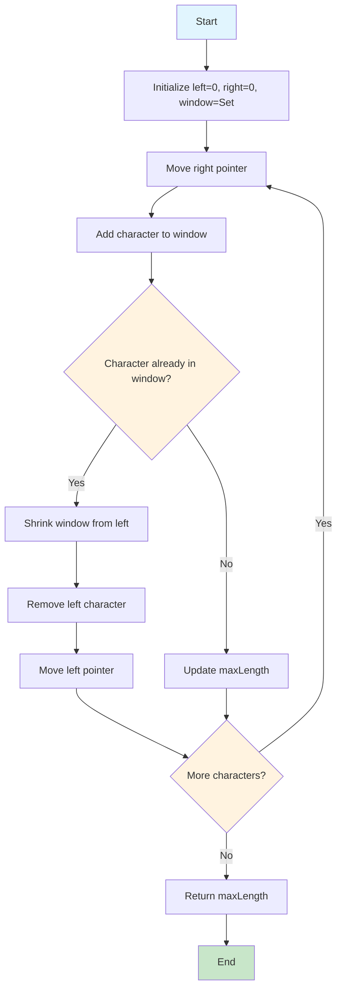
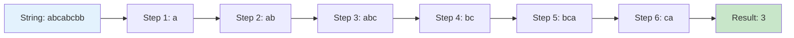
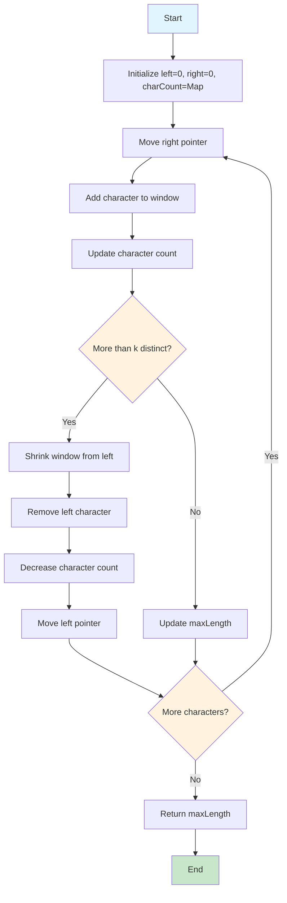
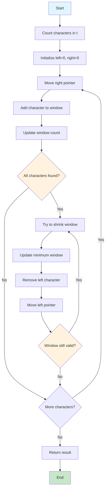
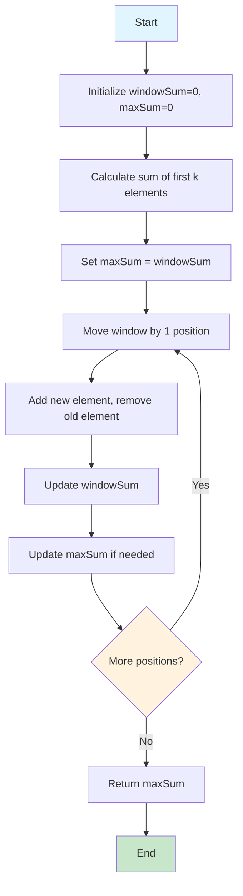
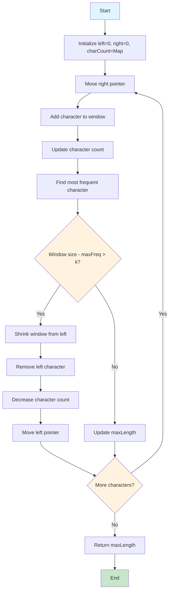

# 🎯 Interactive Sliding Window Algorithm Animations

Welcome to the most comprehensive collection of interactive sliding window algorithm visualizations! Each problem includes step-by-step animations, Mermaid diagrams, and detailed explanations.

## 🚀 Quick Navigation

| Problem | Difficulty | Animation | Mermaid | Code |
|---------|------------|-----------|---------|------|
| [Longest Substring Without Repeating Characters](#1-longest-substring-without-repeating-characters) | Medium | 🎬 | 📊 | 💻 |
| [Longest Substring with K Distinct Characters](#2-longest-substring-with-k-distinct-characters) | Medium | 🎬 | 📊 | 💻 |
| [Minimum Window Substring](#3-minimum-window-substring) | Hard | 🎬 | 📊 | 💻 |
| [Maximum Sum Subarray of Size K](#4-maximum-sum-subarray-of-size-k) | Easy | 🎬 | 📊 | 💻 |
| [Longest Repeating Character Replacement](#5-longest-repeating-character-replacement) | Medium | 🎬 | 📊 | 💻 |

---

## 1. Longest Substring Without Repeating Characters

**Problem**: Find the length of the longest substring without repeating characters.

### 🎬 Interactive Animation
[](sliding_window_simple_animation.html)

### 📊 Algorithm Flowchart


### 📈 Step-by-Step Visualization


### 💻 Java Implementation
```java
public int longestSubstringWithoutRepeating(String s) {
    Set<Character> window = new HashSet<>();
    int left = 0;
    int maxLength = 0;
    
    for (int right = 0; right < s.length(); right++) {
        char currentChar = s.charAt(right);
        
        while (window.contains(currentChar)) {
            window.remove(s.charAt(left));
            left++;
        }
        
        window.add(currentChar);
        maxLength = Math.max(maxLength, right - left + 1);
    }
    
    return maxLength;
}
```

### 📊 Complexity Analysis
| Aspect | Complexity | Explanation |
|--------|------------|-------------|
| Time | O(n) | Each character visited at most twice |
| Space | O(min(m,n)) | m = charset size, n = string length |

---

## 2. Longest Substring with K Distinct Characters

**Problem**: Find the length of the longest substring with at most k distinct characters.

### 🎬 Interactive Animation
[](longest_substring_k_distinct_animation.html)

### 📊 Algorithm Flowchart


### 💻 Java Implementation
```java
public int longestSubstringWithKDistinct(String s, int k) {
    Map<Character, Integer> charCount = new HashMap<>();
    int left = 0;
    int maxLength = 0;
    
    for (int right = 0; right < s.length(); right++) {
        char currentChar = s.charAt(right);
        charCount.put(currentChar, charCount.getOrDefault(currentChar, 0) + 1);
        
        while (charCount.size() > k) {
            char leftChar = s.charAt(left);
            charCount.put(leftChar, charCount.get(leftChar) - 1);
            if (charCount.get(leftChar) == 0) {
                charCount.remove(leftChar);
            }
            left++;
        }
        
        maxLength = Math.max(maxLength, right - left + 1);
    }
    
    return maxLength;
}
```

---

## 3. Minimum Window Substring

**Problem**: Find the minimum window in s that contains all characters in t.

### 🎬 Interactive Animation
[](minimum_window_substring_animation.html)

### 📊 Algorithm Flowchart


### 💻 Java Implementation
```java
public String minWindow(String s, String t) {
    Map<Character, Integer> targetCount = new HashMap<>();
    for (char c : t.toCharArray()) {
        targetCount.put(c, targetCount.getOrDefault(c, 0) + 1);
    }
    
    int required = targetCount.size();
    int formed = 0;
    int left = 0;
    int minLeft = 0;
    int minLength = Integer.MAX_VALUE;
    
    Map<Character, Integer> windowCount = new HashMap<>();
    
    for (int right = 0; right < s.length(); right++) {
        char currentChar = s.charAt(right);
        windowCount.put(currentChar, windowCount.getOrDefault(currentChar, 0) + 1);
        
        if (targetCount.containsKey(currentChar) && 
            windowCount.get(currentChar).intValue() == targetCount.get(currentChar).intValue()) {
            formed++;
        }
        
        while (left <= right && formed == required) {
            char leftChar = s.charAt(left);
            
            if (right - left + 1 < minLength) {
                minLength = right - left + 1;
                minLeft = left;
            }
            
            windowCount.put(leftChar, windowCount.get(leftChar) - 1);
            if (targetCount.containsKey(leftChar) && 
                windowCount.get(leftChar) < targetCount.get(leftChar)) {
                formed--;
            }
            
            left++;
        }
    }
    
    return minLength == Integer.MAX_VALUE ? "" : s.substring(minLeft, minLeft + minLength);
}
```

---

## 4. Maximum Sum Subarray of Size K

**Problem**: Find the maximum sum of any contiguous subarray of size k.

### 🎬 Interactive Animation
[](max_sum_subarray_k_animation.html)

### 📊 Algorithm Flowchart


### 💻 Java Implementation
```java
public int maxSumSubarray(int[] nums, int k) {
    int windowSum = 0;
    int maxSum = 0;
    
    // Calculate sum of first window
    for (int i = 0; i < k; i++) {
        windowSum += nums[i];
    }
    
    maxSum = windowSum;
    
    // Slide the window
    for (int i = k; i < nums.length; i++) {
        windowSum = windowSum - nums[i - k] + nums[i];
        maxSum = Math.max(maxSum, windowSum);
    }
    
    return maxSum;
}
```

---

## 5. Longest Repeating Character Replacement

**Problem**: Find the length of the longest substring containing the same letter after performing at most k character replacements.

### 🎬 Interactive Animation
[](longest_repeating_char_replacement_animation.html)

### 📊 Algorithm Flowchart


### 💻 Java Implementation
```java
public int characterReplacement(String s, int k) {
    Map<Character, Integer> charCount = new HashMap<>();
    int left = 0;
    int maxLength = 0;
    int maxFreq = 0;
    
    for (int right = 0; right < s.length(); right++) {
        char currentChar = s.charAt(right);
        charCount.put(currentChar, charCount.getOrDefault(currentChar, 0) + 1);
        maxFreq = Math.max(maxFreq, charCount.get(currentChar));
        
        if (right - left + 1 - maxFreq > k) {
            char leftChar = s.charAt(left);
            charCount.put(leftChar, charCount.get(leftChar) - 1);
            left++;
        }
        
        maxLength = Math.max(maxLength, right - left + 1);
    }
    
    return maxLength;
}
```

---

## 🎨 Animation Features

### ✨ Visual Elements
- **🎯 Pulsing Pointers**: Left (Red) and Right (Blue) with animations
- **🟢 Window Highlighting**: Characters in current window
- **📊 Real-time Stats**: Window size, max length, character counts
- **🎬 Step Controls**: Play, Pause, Next, Previous, Reset
- **📝 Detailed Explanations**: Each step explained

### 🚀 Interactive Controls
- **Auto-play**: Automatic step-by-step progression
- **Manual Control**: Step through at your own pace
- **Reset**: Start over anytime
- **Speed Control**: Adjustable animation speed

---

## 📚 Learning Resources

### 🎯 Algorithm Patterns
1. **Expand and Contract**: Most common sliding window pattern
2. **Fixed Size Window**: For problems with constant window size
3. **Two Pointers**: Similar technique for sorted arrays

### 📊 Complexity Analysis
| Pattern | Time | Space | When to Use |
|---------|------|-------|-------------|
| Expand & Contract | O(n) | O(k) | Variable window size |
| Fixed Size | O(n) | O(1) | Constant window size |
| Two Pointers | O(n) | O(1) | Sorted arrays |

### 🔧 Implementation Tips
- Use `HashSet` for unique elements
- Use `HashMap` for character counting
- Use `Deque` for maintaining order
- Handle edge cases (empty strings, invalid inputs)

---

## 🤝 Contributing

Want to add more problems or improve existing animations?

1. **Fork the repository**
2. **Create a new animation** following the existing pattern
3. **Add Mermaid diagrams** for the algorithm
4. **Update this README** with your new problem
5. **Submit a pull request**

---

## 📄 License

This project is open source and available under the [MIT License](LICENSE).

---

**🎯 Master the sliding window technique with interactive visualizations!**

*Each animation is designed to help you understand the algorithm step-by-step, making complex problems easy to visualize and learn.*
