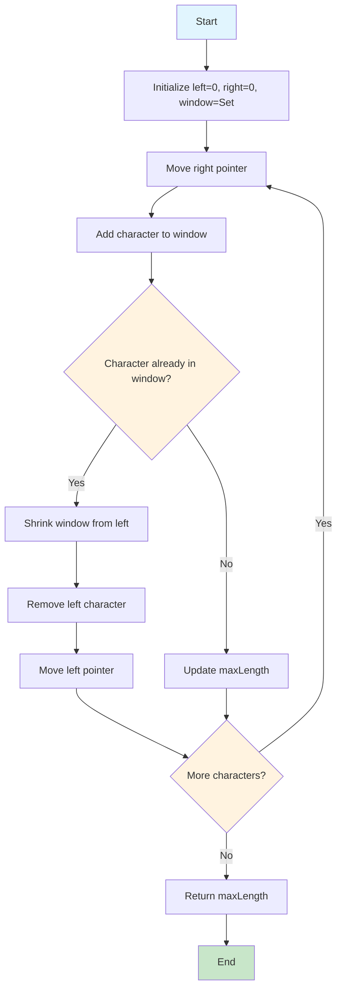
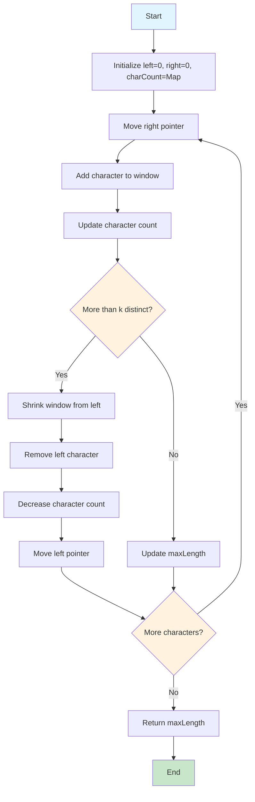
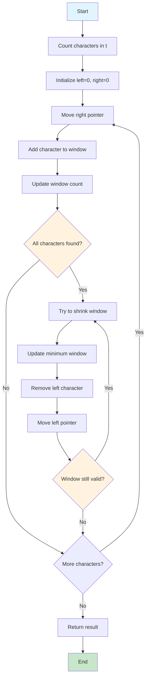
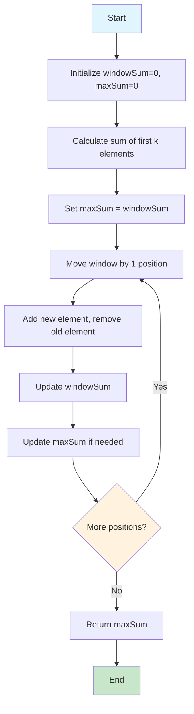
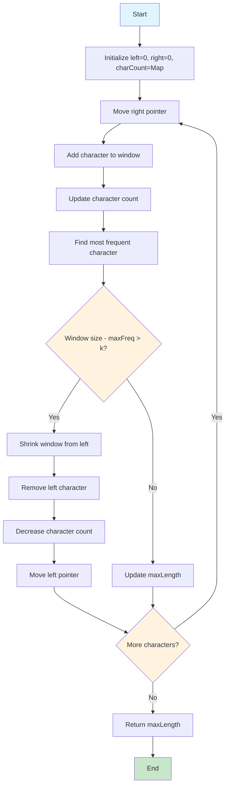
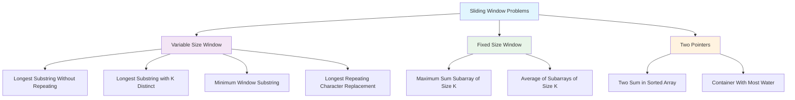

# 🎯 Master Sliding Window Algorithm Collection

**The most comprehensive collection of interactive sliding window algorithm visualizations!**

[](https://yourusername.github.io/yourrepository/)
[](#interactive-animations)
[](#mermaid-diagrams)

---

## 🚀 Quick Start

### Option 1: View All Animations
[](index.html)

### Option 2: Individual Problem Animations
| Problem | Animation | Mermaid | Difficulty |
|---------|-----------|---------|------------|
| [Longest Substring Without Repeating Characters](#1-longest-substring-without-repeating-characters) | [🎬 View](sliding_window_simple_animation.html) | [📊 Diagram](#mermaid-1) | Medium |
| [Longest Substring with K Distinct Characters](#2-longest-substring-with-k-distinct-characters) | [🎬 View](longest_substring_k_distinct_animation.html) | [📊 Diagram](#mermaid-2) | Medium |
| [Minimum Window Substring](#3-minimum-window-substring) | [🎬 View](minimum_window_substring_animation.html) | [📊 Diagram](#mermaid-3) | Hard |
| [Maximum Sum Subarray of Size K](#4-maximum-sum-subarray-of-size-k) | [🎬 View](max_sum_subarray_k_animation.html) | [📊 Diagram](#mermaid-4) | Easy |
| [Longest Repeating Character Replacement](#5-longest-repeating-character-replacement) | [🎬 View](longest_repeating_char_replacement_animation.html) | [📊 Diagram](#mermaid-5) | Medium |

---

## 🎬 Interactive Animations

### 1. Longest Substring Without Repeating Characters

**Problem**: Find the length of the longest substring without repeating characters.

#### 🎯 Live Animation
[](sliding_window_simple_animation.html)

#### 📊 Algorithm Flowchart


#### 💻 Java Implementation
```java
public int longestSubstringWithoutRepeating(String s) {
    Set<Character> window = new HashSet<>();
    int left = 0;
    int maxLength = 0;
    
    for (int right = 0; right < s.length(); right++) {
        char currentChar = s.charAt(right);
        
        while (window.contains(currentChar)) {
            window.remove(s.charAt(left));
            left++;
        }
        
        window.add(currentChar);
        maxLength = Math.max(maxLength, right - left + 1);
    }
    
    return maxLength;
}
```

#### 📈 Step-by-Step Example
```
Input: "abcabcbb"

Step 1: [a]bcabcbb     (window: {a}, maxLength: 1)
Step 2: [ab]cabcbb     (window: {a,b}, maxLength: 2)
Step 3: [abc]abcbb     (window: {a,b,c}, maxLength: 3)
Step 4: a[bc]abcbb     (window: {b,c}, maxLength: 3)
Step 5: a[bca]bcbb     (window: {b,c,a}, maxLength: 3)
Step 6: ab[ca]bcbb     (window: {c,a}, maxLength: 3)
...

Result: 3 (substring "abc")
```

---

### 2. Longest Substring with K Distinct Characters

**Problem**: Find the length of the longest substring with at most k distinct characters.

#### 🎯 Live Animation
[](longest_substring_k_distinct_animation.html)

#### 📊 Algorithm Flowchart


#### 💻 Java Implementation
```java
public int longestSubstringWithKDistinct(String s, int k) {
    Map<Character, Integer> charCount = new HashMap<>();
    int left = 0;
    int maxLength = 0;
    
    for (int right = 0; right < s.length(); right++) {
        char currentChar = s.charAt(right);
        charCount.put(currentChar, charCount.getOrDefault(currentChar, 0) + 1);
        
        while (charCount.size() > k) {
            char leftChar = s.charAt(left);
            charCount.put(leftChar, charCount.get(leftChar) - 1);
            if (charCount.get(leftChar) == 0) {
                charCount.remove(leftChar);
            }
            left++;
        }
        
        maxLength = Math.max(maxLength, right - left + 1);
    }
    
    return maxLength;
}
```

---

### 3. Minimum Window Substring

**Problem**: Find the minimum window in s that contains all characters in t.

#### 🎯 Live Animation
[](minimum_window_substring_animation.html)

#### 📊 Algorithm Flowchart


---

### 4. Maximum Sum Subarray of Size K

**Problem**: Find the maximum sum of any contiguous subarray of size k.

#### 🎯 Live Animation
[](max_sum_subarray_k_animation.html)

#### 📊 Algorithm Flowchart


---

### 5. Longest Repeating Character Replacement

**Problem**: Find the length of the longest substring containing the same letter after performing at most k character replacements.

#### 🎯 Live Animation
[](longest_repeating_char_replacement_animation.html)

#### 📊 Algorithm Flowchart


---

## 🎨 Animation Features

### ✨ Visual Elements
- **🎯 Pulsing Pointers**: Left (Red) and Right (Blue) with smooth animations
- **🟢 Window Highlighting**: Characters in current window with glow effects
- **📊 Real-time Stats**: Window size, max length, character counts
- **🎬 Step Controls**: Play, Pause, Next, Previous, Reset
- **📝 Detailed Explanations**: Each step explained with context

### 🚀 Interactive Controls
- **Auto-play**: Automatic step-by-step progression
- **Manual Control**: Step through at your own pace
- **Reset**: Start over anytime
- **Speed Control**: Adjustable animation speed

### 🎯 Color Coding
- **🟢 Green**: Characters in the current window
- **🔴 Red**: Left pointer (L) with pulsing animation
- **🔵 Blue**: Right pointer (R) with pulsing animation
- **⚪ White**: Characters outside the window

---

## 📊 Mermaid Diagrams

### Algorithm Comparison


### Complexity Analysis
```mermaid
graph LR
    A[Sliding Window] --> B[Time: O(n)]
    A --> C[Space: O(k)]
    
    B --> D[Each element visited at most twice]
    C --> E[k = number of unique elements]
    
    style A fill:#e1f5fe
    style B fill:#c8e6c9
    style C fill:#fff3e0
```

---

## 🛠️ How to Use

### For GitHub README
1. **Copy the markdown code** from this file
2. **Paste into your README.md**
3. **Mermaid diagrams render automatically** in GitHub
4. **Link to HTML animations** for interactive experience

### For GitHub Pages
1. **Enable GitHub Pages** in repository settings
2. **Upload HTML files** to your repository
3. **Access animations** at `https://yourusername.github.io/yourrepository/`

### For Local Development
1. **Clone the repository**
2. **Open HTML files** in your browser
3. **Customize animations** as needed

---

## 🎯 Learning Path

### Beginner
1. **Maximum Sum Subarray of Size K** - Fixed size window
2. **Longest Substring Without Repeating Characters** - Variable size window

### Intermediate
3. **Longest Substring with K Distinct Characters** - Character counting
4. **Longest Repeating Character Replacement** - Advanced character counting

### Advanced
5. **Minimum Window Substring** - Complex constraint satisfaction

---

## 🤝 Contributing

Want to add more problems or improve existing animations?

1. **Fork the repository**
2. **Use the animation generator** to create new animations
3. **Add Mermaid diagrams** for new problems
4. **Update this README** with your additions
5. **Submit a pull request**

---

## 📚 Resources

### Algorithm Patterns
- **Expand and Contract**: Most common sliding window pattern
- **Fixed Size Window**: For problems with constant window size
- **Two Pointers**: Similar technique for sorted arrays

### Data Structures
- **HashSet**: For tracking unique elements
- **HashMap**: For counting frequencies
- **Deque**: For maintaining order

### Complexity Guidelines
- **Time**: Usually O(n) - each element visited at most twice
- **Space**: Usually O(k) - where k is the number of unique elements

---

## 📄 License

This project is open source and available under the [MIT License](LICENSE).

---

**🎯 Master the sliding window technique with interactive visualizations!**

*Each animation is designed to help you understand the algorithm step-by-step, making complex problems easy to visualize and learn.*

---

## 🔗 Quick Links

- [🎬 All Animations](index.html)
- [📚 Complete Documentation](SLIDING_WINDOW_DOCUMENTATION.md)
- [🛠️ Animation Generator](animation_generator_template.html)
- [📊 Mermaid Diagrams](sliding_window_mermaid_diagram.md)
