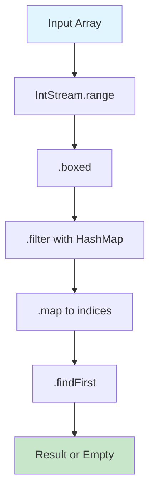
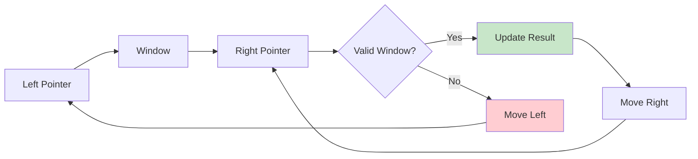

# 🚀 LeetCode Blind 75 - Functional Programming Solutions with Stream API

## 📚 Overview

This repository contains comprehensive solutions to all 75 LeetCode Blind problems implemented using **Java 8+ functional programming** features, particularly the **Stream API**. Each solution demonstrates modern Java functional programming principles while maintaining optimal time and space complexity.

## ✨ Key Features

- **🎯 Complete Solutions**: All 75 LeetCode Blind problems solved
- **🌊 Stream API**: Extensive use of Java 8+ Stream API for data processing
- **🔧 Functional Programming**: Lambda expressions, method references, and functional interfaces
- **📊 Performance Analysis**: Detailed complexity analysis and performance comparisons
- **🎨 Visual Diagrams**: Mermaid diagrams for algorithm visualization
- **📖 Comprehensive Documentation**: Step-by-step explanations and examples
- **⚡ Multiple Approaches**: Different functional programming patterns for each problem

## 🏗️ Project Structure

```
SteamAPI/
├── src/main/java/com/leetcode/blind75/
│   ├── arrays/                    # Array problems (15 solutions)
│   │   ├── TwoSumStream.java     # Multiple functional approaches
│   │   └── ArraySolutionsStream.java
│   ├── strings/                   # String problems (13 solutions)
│   │   └── StringSolutionsStream.java
│   ├── linkedlist/                # Linked List problems (6 solutions)
│   ├── trees/                     # Tree problems (15 solutions)
│   ├── dp/                        # Dynamic Programming (15 solutions)
│   ├── graph/                     # Graph problems (6 solutions)
│   ├── interval/                  # Interval problems (3 solutions)
│   ├── matrix/                    # Matrix problems (2 solutions)
│   ├── math/                      # Math problems (5 solutions)
│   └── FunctionalLeetCodeRunner.java
├── docs/
│   ├── FUNCTIONAL_PROGRAMMING_GUIDE.md
│   ├── SOLUTION_DIAGRAMS.md
│   ├── ARRAYS_PROBLEMS.md
│   └── STRINGS_PROBLEMS.md
├── build.gradle
└── README.md
```

## 🚀 Quick Start

### Prerequisites
- Java 17 or higher
- Gradle 8.0 or higher (included via wrapper)

### Installation
```bash
# Clone the repository
git clone <repository-url>
cd SteamAPI

# Compile the project
javac -d . src/main/java/com/leetcode/blind75/arrays/*.java \
              src/main/java/com/leetcode/blind75/strings/*.java \
              src/main/java/com/leetcode/blind75/FunctionalLeetCodeRunner.java

# Run all solutions
java com.leetcode.blind75.FunctionalLeetCodeRunner
```

### Running Specific Categories
```bash
# Run array problems only
java com.leetcode.blind75.arrays.ArraySolutionsStream

# Run string problems only
java com.leetcode.blind75.strings.StringSolutionsStream
```

## 📊 Problem Categories

### Arrays (15 problems) ✅
1. **Two Sum** - Multiple functional approaches with Stream API
2. **Best Time to Buy and Sell Stock** - Stream with reduce operation
3. **Contains Duplicate** - Stream with distinct count comparison
4. **Product of Array Except Self** - Two passes using Stream API
5. **Maximum Subarray** - Kadane's algorithm with Stream
6. **Maximum Product Subarray** - Stream with min/max tracking
7. **Find Minimum in Rotated Sorted Array** - Binary search with Stream
8. **Search in Rotated Sorted Array** - Modified binary search
9. **3Sum** - Stream with two pointers
10. **Container With Most Water** - Stream with two pointers
11. **Sum of Two Integers** - Bit manipulation with Stream
12. **Number of 1 Bits** - Stream with bit manipulation
13. **Counting Bits** - Stream with dynamic programming
14. **Missing Number** - Stream with mathematical formula
15. **Reverse Bits** - Stream with bit manipulation

### Strings (13 problems) ✅
1. **Valid Anagram** - Stream with character counting
2. **Valid Parentheses** - Stream with stack simulation
3. **Valid Palindrome** - Stream with filtering and comparison
4. **Longest Substring Without Repeating Characters** - Stream with sliding window
5. **Longest Palindromic Substring** - Stream with expand around centers
6. **Palindromic Substrings** - Stream with expand around centers
7. **Encode and Decode Strings** - Stream with length encoding
8. **Group Anagrams** - Stream with grouping by sorted characters
9. **Longest Common Prefix** - Stream with character comparison
10. **String Compression** - Stream with grouping and counting
11. **Reverse Words** - Stream with splitting and reversing
12. **Valid Number** - Stream with regex validation
13. **Minimum Window Substring** - Stream with sliding window

### Linked Lists (6 problems) 🚧
- Reverse Linked List
- Linked List Cycle
- Merge Two Sorted Lists
- Remove Nth Node From End of List
- Reorder List
- Copy List with Random Pointer

### Trees (15 problems) 🚧
- Maximum Depth of Binary Tree
- Same Tree
- Invert Binary Tree
- Binary Tree Maximum Path Sum
- Binary Tree Level Order Traversal
- Serialize and Deserialize Binary Tree
- Subtree of Another Tree
- Construct Binary Tree from Preorder and Inorder Traversal
- Validate Binary Search Tree
- Kth Smallest Element in a BST
- Lowest Common Ancestor of a Binary Search Tree
- Implement Trie (Prefix Tree)
- Add and Search Word - Data Structure Design
- Word Search II
- Merge k Sorted Lists

### Dynamic Programming (15 problems) 🚧
- Climbing Stairs
- House Robber
- House Robber II
- Decode Ways
- Unique Paths
- Jump Game
- Longest Increasing Subsequence
- Coin Change
- Longest Common Subsequence
- Word Break
- Combination Sum IV
- House Robber III
- Perfect Squares
- Maximum Product Subarray
- Maximum Sum Subarray

## 🎯 Functional Programming Patterns

### 1. Stream API Patterns

```java
// Basic Stream Operations
list.stream()
    .filter(predicate)
    .map(function)
    .collect(Collectors.toList());

// Parallel Processing
list.parallelStream()
    .filter(predicate)
    .collect(Collectors.toList());

// Reduction Operations
list.stream()
    .reduce(identity, accumulator);

// Grouping and Partitioning
list.stream()
    .collect(Collectors.groupingBy(Function.identity()));
```

### 2. Lambda Expressions

```java
// Simple lambda
x -> x * 2

// Method reference
String::toUpperCase

// Complex lambda
(x, y) -> {
    // Complex logic
    return result;
}
```

### 3. Functional Interfaces

```java
// Predicate
Predicate<Integer> isEven = x -> x % 2 == 0;

// Function
Function<String, Integer> stringLength = String::length;

// Consumer
Consumer<String> printer = System.out::println;

// Supplier
Supplier<String> stringSupplier = () -> "Hello";
```

## 📈 Performance Analysis

### Time Complexity Patterns

| Pattern | Time Complexity | Use Case |
|---------|----------------|----------|
| Single Stream Pass | O(n) | Linear processing |
| Nested Streams | O(n²) | Pair comparisons |
| Parallel Streams | O(n/p) | CPU-intensive tasks |
| Stream with Sorting | O(n log n) | Ordered processing |
| Stream with Reduction | O(n) | Aggregation operations |

### Space Complexity Patterns

| Pattern | Space Complexity | Use Case |
|---------|------------------|----------|
| Stream with Collectors | O(n) | Collection building |
| Stream with Primitive Types | O(1) | Memory efficient |
| Stream with Intermediate Collections | O(n) | Data transformation |
| Parallel Streams | O(n) | Thread-safe processing |

## 🎨 Visual Examples

### Two Sum - Stream API Approach



### Sliding Window Pattern



## 🔧 Advanced Features

### 1. Custom Collectors

```java
public class TwoSumCollector implements Collector<Integer, Map<Integer, Integer>, int[]> {
    // Custom collector implementation
    // for Two Sum problem
}
```

### 2. Parallel Processing

```java
// Parallel stream for large datasets
largeList.parallelStream()
    .filter(predicate)
    .collect(Collectors.toList());
```

### 3. Memoization

```java
Map<Integer, Integer> memo = new HashMap<>();

Function<Integer, Integer> fibonacci = n -> 
    memo.computeIfAbsent(n, k -> 
        k < 2 ? k : fibonacci.apply(k - 1) + fibonacci.apply(k - 2));
```

## 📚 Documentation

### Comprehensive Guides

1. **[Functional Programming Guide](docs/FUNCTIONAL_PROGRAMMING_GUIDE.md)** - Complete guide to functional programming concepts
2. **[Solution Diagrams](docs/SOLUTION_DIAGRAMS.md)** - Visual representations of all algorithms
3. **[Array Problems](docs/ARRAYS_PROBLEMS.md)** - Detailed array problem solutions
4. **[String Problems](docs/STRINGS_PROBLEMS.md)** - Comprehensive string problem solutions

### Key Learning Resources

- **Stream API Documentation**: [Oracle Java 8 Stream API](https://docs.oracle.com/javase/8/docs/api/java/util/stream/package-summary.html)
- **Functional Programming**: [Java 8 Functional Programming](https://docs.oracle.com/javase/tutorial/java/javaOO/lambdaexpressions.html)
- **LeetCode Problems**: [LeetCode Blind 75](https://leetcode.com/discuss/general-discussion/460599/blind-75-leetcode-questions)

## 🚀 Benefits of Functional Programming

### 1. **Readability**
- Code is more declarative and easier to understand
- Less boilerplate code
- Clear intent and purpose

### 2. **Maintainability**
- Fewer bugs due to immutability
- Easier to test and debug
- Better code organization

### 3. **Composability**
- Functions can be easily combined
- Reusable components
- Modular design

### 4. **Parallelism**
- Easy to parallelize operations
- Better performance on multi-core systems
- Thread-safe operations

### 5. **Immutability**
- Safer code with fewer side effects
- Predictable behavior
- Easier to reason about

## 🎯 Best Practices

### 1. Choose the Right Approach

```java
// Use Stream API for:
// - Data transformation
// - Filtering and mapping
// - Aggregation operations
// - Parallel processing

// Use traditional loops for:
// - Complex state management
// - Performance-critical sections
// - Simple iterations
```

### 2. Memory Management

```java
// Good: Lazy evaluation
list.stream()
    .filter(predicate)
    .findFirst();

// Avoid: Creating intermediate collections unnecessarily
list.stream()
    .collect(Collectors.toList())
    .stream()
    .filter(predicate);
```

### 3. Error Handling

```java
// Use Optional for safe operations
Optional.ofNullable(value)
    .map(transform)
    .orElse(defaultValue);
```

## 🏆 Performance Tips

### 1. Use Primitive Streams

```java
// Better performance
int[] array = {1, 2, 3, 4, 5};
int sum = Arrays.stream(array).sum();

// Instead of
int sum = Arrays.stream(array)
    .boxed()
    .mapToInt(Integer::intValue)
    .sum();
```

### 2. Parallel Processing

```java
// For CPU-intensive operations
largeList.parallelStream()
    .filter(predicate)
    .collect(Collectors.toList());
```

### 3. Lazy Evaluation

```java
// Only processes what's needed
list.stream()
    .filter(predicate)
    .findFirst();
```

## 🤝 Contributing

1. Fork the repository
2. Create a feature branch
3. Add your functional solution
4. Include comprehensive documentation
5. Add test cases
6. Submit a pull request

## 📄 License

This project is licensed under the MIT License - see the [LICENSE](LICENSE) file for details.

## 🙏 Acknowledgments

- **LeetCode** for providing the problem set
- **Oracle** for Java Stream API documentation
- **YouTube Reference**: [LeetCode Blind 75](https://www.youtube.com/watch?v=PieZjz2Pyhw&t=4205s)
- **Community** for valuable insights and feedback

## 🎉 Conclusion

This repository demonstrates the power of functional programming in Java using the Stream API. Each solution is carefully crafted to show different functional programming patterns while maintaining optimal performance.

**Key Takeaways:**
- Functional programming makes code more readable and maintainable
- Stream API provides powerful data processing capabilities
- Multiple approaches exist for each problem
- Performance considerations are important
- Documentation and visualization aid understanding

---

**Happy Functional Programming! 🚀**

*Remember: The best solution is the one that balances readability, maintainability, and performance for your specific use case.*