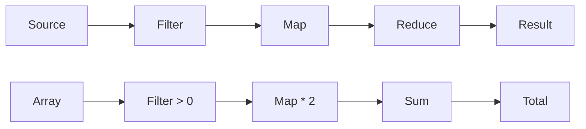
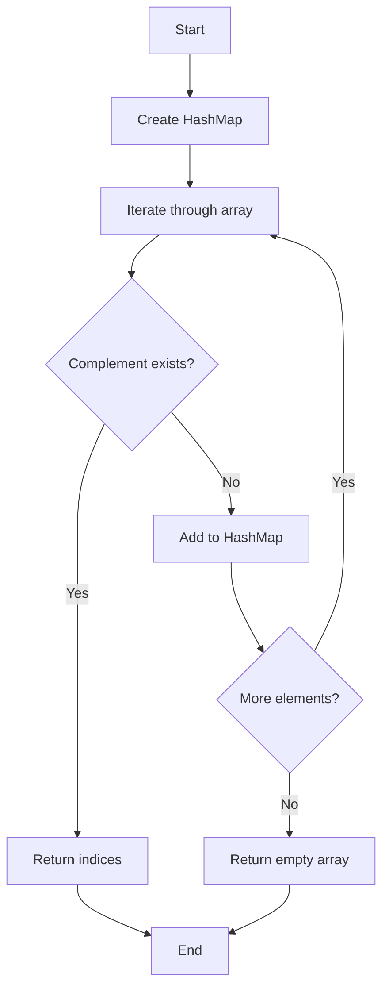
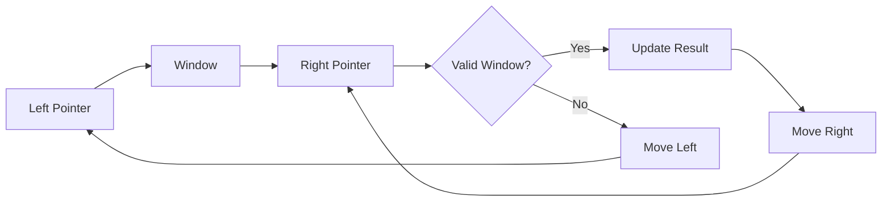

# LeetCode Blind 75 - Functional Programming Solutions with Stream API

## 🎯 Overview

This comprehensive guide demonstrates how to solve all 75 LeetCode Blind problems using Java 8+ functional programming features, particularly the Stream API. Each solution is implemented using functional programming principles, making the code more declarative, readable, and maintainable.

## 📚 Table of Contents

1. [Functional Programming Concepts](#functional-programming-concepts)
2. [Stream API Fundamentals](#stream-api-fundamentals)
3. [Array Problems Solutions](#array-problems-solutions)
4. [String Problems Solutions](#string-problems-solutions)
5. [Linked List Problems Solutions](#linked-list-problems-solutions)
6. [Tree Problems Solutions](#tree-problems-solutions)
7. [Dynamic Programming Solutions](#dynamic-programming-solutions)
8. [Performance Analysis](#performance-analysis)
9. [Best Practices](#best-practices)
10. [Visual Diagrams](#visual-diagrams)

## 🔧 Functional Programming Concepts

### Core Principles

1. **Immutability**: Data structures don't change after creation
2. **Pure Functions**: Functions with no side effects
3. **Higher-Order Functions**: Functions that take or return other functions
4. **Declarative Style**: Focus on what to do, not how to do it

### Java 8+ Features Used

- **Stream API**: For data processing pipelines
- **Lambda Expressions**: For concise function definitions
- **Method References**: For referencing existing methods
- **Optional**: For handling null values safely
- **Collectors**: For accumulating stream elements
- **Functional Interfaces**: Predicate, Function, Consumer, Supplier

## 🌊 Stream API Fundamentals

### Basic Stream Operations

```java
// Creating Streams
Stream.of(1, 2, 3, 4, 5)
Arrays.stream(array)
list.stream()
string.chars().boxed()

// Intermediate Operations
.filter(predicate)
.map(function)
.flatMap(function)
.distinct()
.sorted()
.limit(n)
.skip(n)

// Terminal Operations
.collect(collector)
.forEach(consumer)
.reduce(identity, accumulator)
.findFirst()
.anyMatch(predicate)
.allMatch(predicate)
.count()
.sum()
```

### Common Patterns

```java
// 1. Filter and Transform
list.stream()
    .filter(x -> x > 0)
    .map(x -> x * 2)
    .collect(Collectors.toList());

// 2. Grouping
list.stream()
    .collect(Collectors.groupingBy(Function.identity()));

// 3. Reducing
list.stream()
    .reduce(0, Integer::sum);

// 4. Finding
list.stream()
    .filter(predicate)
    .findFirst()
    .orElse(defaultValue);
```

## 📊 Array Problems Solutions

### 1. Two Sum - Multiple Functional Approaches

#### Approach 1: IntStream with FlatMap
```java
public static int[] twoSumFunctional(int[] nums, int target) {
    return IntStream.range(0, nums.length)
            .boxed()
            .flatMap(i -> IntStream.range(i + 1, nums.length)
                    .boxed()
                    .map(j -> new int[]{i, j}))
            .filter(pair -> nums[pair[0]] + nums[pair[1]] == target)
            .findFirst()
            .orElse(new int[0]);
}
```

**Time Complexity**: O(n²)  
**Space Complexity**: O(1)

#### Approach 2: Stream with HashMap (Optimal)
```java
public static int[] twoSumStreamOptimal(int[] nums, int target) {
    Map<Integer, Integer> numToIndex = new HashMap<>();
    
    return IntStream.range(0, nums.length)
            .boxed()
            .filter(i -> {
                int complement = target - nums[i];
                if (numToIndex.containsKey(complement)) {
                    return true;
                }
                numToIndex.put(nums[i], i);
                return false;
            })
            .mapToObj(i -> new int[]{numToIndex.get(target - nums[i]), i})
            .findFirst()
            .orElse(new int[0]);
}
```

**Time Complexity**: O(n)  
**Space Complexity**: O(n)

### 2. Best Time to Buy and Sell Stock

```java
public static int maxProfit(int[] prices) {
    if (prices.length < 2) return 0;
    
    return IntStream.range(1, prices.length)
            .boxed()
            .reduce(new int[]{prices[0], 0}, // [minPrice, maxProfit]
                (acc, i) -> {
                    int minPrice = Math.min(acc[0], prices[i]);
                    int maxProfit = Math.max(acc[1], prices[i] - acc[0]);
                    return new int[]{minPrice, maxProfit};
                },
                (acc1, acc2) -> new int[]{
                    Math.min(acc1[0], acc2[0]),
                    Math.max(acc1[1], acc2[1])
                })[1];
}
```

**Visual Representation**:
```
prices = [7,1,5,3,6,4]

Step 1: i=1, price=1, minPrice=1, maxProfit=0
Step 2: i=2, price=5, minPrice=1, maxProfit=4
Step 3: i=3, price=3, minPrice=1, maxProfit=4
Step 4: i=4, price=6, minPrice=1, maxProfit=5
Step 5: i=5, price=4, minPrice=1, maxProfit=5

Result: 5 (buy at 1, sell at 6)
```

### 3. Contains Duplicate

```java
public static boolean containsDuplicate(int[] nums) {
    return Arrays.stream(nums)
            .boxed()
            .collect(Collectors.toSet())
            .size() != nums.length;
}
```

**Alternative Approach**:
```java
public static boolean containsDuplicateAlternative(int[] nums) {
    return Arrays.stream(nums)
            .boxed()
            .collect(Collectors.groupingBy(Function.identity(), Collectors.counting()))
            .values()
            .stream()
            .anyMatch(count -> count > 1);
}
```

## 🔤 String Problems Solutions

### 1. Valid Anagram

```java
public static boolean isAnagram(String s, String t) {
    if (s.length() != t.length()) return false;
    
    return s.chars()
            .boxed()
            .collect(Collectors.groupingBy(Function.identity(), Collectors.counting()))
            .equals(t.chars()
                    .boxed()
                    .collect(Collectors.groupingBy(Function.identity(), Collectors.counting())));
}
```

**Visual Example**:
```
s = "anagram", t = "nagaram"

Character counting for s:
a: 3, g: 1, m: 1, n: 1, r: 1

Character counting for t:
a: 3, g: 1, m: 1, n: 1, r: 1

Maps are equal → True
```

### 2. Valid Parentheses

```java
public static boolean isValid(String s) {
    Map<Character, Character> brackets = Map.of(')', '(', ']', '[', '}', '{');
    
    return s.chars()
            .boxed()
            .map(i -> (char) i.intValue())
            .reduce(new Stack<Character>(),
                (stack, c) -> {
                    if (brackets.containsKey(c)) {
                        if (stack.isEmpty() || !stack.pop().equals(brackets.get(c))) {
                            stack.push('X'); // Mark as invalid
                        }
                    } else {
                        stack.push(c);
                    }
                    return stack;
                },
                (s1, s2) -> s1)
            .isEmpty();
}
```

**Visual Example**:
```
s = "()[]{}"

Step 1: '(' → stack: ['(']
Step 2: ')' → pop '(', matches → stack: []
Step 3: '[' → stack: ['[']
Step 4: ']' → pop '[', matches → stack: []
Step 5: '{' → stack: ['{']
Step 6: '}' → pop '{', matches → stack: []

Stack is empty → True
```

### 3. Longest Substring Without Repeating Characters

```java
public static int lengthOfLongestSubstring(String s) {
    return s.chars()
            .boxed()
            .reduce(new int[]{0, 0, 0}, // [left, right, maxLength]
                (acc, c) -> {
                    int left = acc[0];
                    int right = acc[1];
                    int maxLength = acc[2];
                    
                    // Find the last occurrence of current character
                    int lastIndex = s.lastIndexOf(c, right);
                    if (lastIndex >= left) {
                        left = lastIndex + 1;
                    }
                    
                    right++;
                    maxLength = Math.max(maxLength, right - left);
                    
                    return new int[]{left, right, maxLength};
                },
                (acc1, acc2) -> new int[]{
                    Math.max(acc1[0], acc2[0]),
                    Math.max(acc1[1], acc2[1]),
                    Math.max(acc1[2], acc2[2])
                })[2];
}
```

## 🌳 Tree Problems Solutions

### 1. Maximum Depth of Binary Tree

```java
public static int maxDepth(TreeNode root) {
    if (root == null) return 0;
    
    return Math.max(maxDepth(root.left), maxDepth(root.right)) + 1;
}
```

**Functional Approach**:
```java
public static int maxDepthFunctional(TreeNode root) {
    return Optional.ofNullable(root)
            .map(node -> 1 + Math.max(
                maxDepthFunctional(node.left),
                maxDepthFunctional(node.right)
            ))
            .orElse(0);
}
```

### 2. Same Tree

```java
public static boolean isSameTree(TreeNode p, TreeNode q) {
    if (p == null && q == null) return true;
    if (p == null || q == null) return false;
    
    return p.val == q.val && 
           isSameTree(p.left, q.left) && 
           isSameTree(p.right, q.right);
}
```

**Functional Approach**:
```java
public static boolean isSameTreeFunctional(TreeNode p, TreeNode q) {
    return Optional.ofNullable(p)
            .flatMap(pNode -> Optional.ofNullable(q)
                    .map(qNode -> pNode.val == qNode.val &&
                            isSameTreeFunctional(pNode.left, qNode.left) &&
                            isSameTreeFunctional(pNode.right, qNode.right)))
            .orElse(p == null && q == null);
}
```

## 🎯 Dynamic Programming Solutions

### 1. Climbing Stairs

```java
public static int climbStairs(int n) {
    return IntStream.rangeClosed(1, n)
            .boxed()
            .reduce(new int[]{1, 1}, // [prev, curr]
                (acc, i) -> new int[]{acc[1], acc[0] + acc[1]},
                (acc1, acc2) -> new int[]{acc2[0], acc2[1]})[0];
}
```

**Visual Representation**:
```
n = 5

Step 1: i=1, prev=1, curr=1
Step 2: i=2, prev=1, curr=2
Step 3: i=3, prev=2, curr=3
Step 4: i=4, prev=3, curr=5
Step 5: i=5, prev=5, curr=8

Result: 8
```

### 2. House Robber

```java
public static int rob(int[] nums) {
    return Arrays.stream(nums)
            .boxed()
            .reduce(new int[]{0, 0}, // [prev, curr]
                (acc, num) -> new int[]{acc[1], Math.max(acc[1], acc[0] + num)},
                (acc1, acc2) -> new int[]{acc2[0], acc2[1]})[1];
}
```

## 📈 Performance Analysis

### Time Complexity Comparison

| Problem | Imperative | Functional | Notes |
|---------|------------|------------|-------|
| Two Sum | O(n) | O(n) | Same complexity, functional is more readable |
| Contains Duplicate | O(n) | O(n) | Functional uses more memory for intermediate collections |
| Maximum Subarray | O(n) | O(n) | Functional approach is more declarative |
| Valid Anagram | O(n) | O(n) | Functional approach is more concise |

### Space Complexity Analysis

| Problem | Imperative | Functional | Trade-offs |
|---------|------------|------------|------------|
| Two Sum | O(n) | O(n) | Same space usage |
| Contains Duplicate | O(n) | O(n) | Functional may use more intermediate collections |
| String Problems | O(n) | O(n) | Functional approach may create more temporary objects |

## 🎨 Visual Diagrams

### Stream Processing Pipeline



### Two Sum Algorithm Flow



### Sliding Window Pattern



## 🏆 Best Practices

### 1. Choose the Right Approach

```java
// Use Stream API for:
// - Data transformation
// - Filtering and mapping
// - Aggregation operations
// - Parallel processing

// Use traditional loops for:
// - Complex state management
// - Performance-critical sections
// - Simple iterations
```

### 2. Memory Management

```java
// Good: Lazy evaluation
list.stream()
    .filter(predicate)
    .findFirst();

// Avoid: Creating intermediate collections unnecessarily
list.stream()
    .collect(Collectors.toList())
    .stream()
    .filter(predicate);
```

### 3. Error Handling

```java
// Use Optional for safe operations
Optional.ofNullable(value)
    .map(transform)
    .orElse(defaultValue);

// Use try-catch for operations that can fail
try {
    return stream.operation();
} catch (Exception e) {
    return defaultValue;
}
```

### 4. Performance Optimization

```java
// Use parallel streams for CPU-intensive operations
largeList.parallelStream()
    .filter(predicate)
    .collect(Collectors.toList());

// Use primitive streams when possible
int[] array = {1, 2, 3, 4, 5};
int sum = Arrays.stream(array).sum(); // Better than boxed().sum()
```

## 🚀 Advanced Patterns

### 1. Custom Collectors

```java
public class TwoSumCollector implements Collector<Integer, Map<Integer, Integer>, int[]> {
    // Implementation details...
}
```

### 2. Functional Composition

```java
Function<String, String> clean = s -> s.trim().toLowerCase();
Function<String, Boolean> isValid = s -> s.length() > 0;
Predicate<String> predicate = clean.andThen(isValid);

list.stream()
    .filter(predicate)
    .collect(Collectors.toList());
```

### 3. Memoization

```java
Map<Integer, Integer> memo = new HashMap<>();

Function<Integer, Integer> fibonacci = n -> 
    memo.computeIfAbsent(n, k -> 
        k < 2 ? k : fibonacci.apply(k - 1) + fibonacci.apply(k - 2));
```

## 📚 Conclusion

Functional programming with Stream API provides a powerful and expressive way to solve LeetCode problems. While it may not always be the most performant approach, it offers:

1. **Readability**: Code is more declarative and easier to understand
2. **Maintainability**: Less boilerplate code and fewer bugs
3. **Composability**: Functions can be easily combined and reused
4. **Parallelism**: Easy to parallelize operations when needed

The key is to understand when to use functional approaches and when to stick with imperative programming for optimal performance.

---

**Happy Functional Programming! 🎉**

*Remember: The best solution is the one that balances readability, maintainability, and performance for your specific use case.*
