# LeetCode Blind 75 - Solution Diagrams and Visualizations

## 🎨 Visual Representations of Algorithms

This document contains comprehensive diagrams and visualizations for all LeetCode Blind 75 problems solved using functional programming approaches.

## 📊 Array Problems Diagrams

### 1. Two Sum - Functional Approach

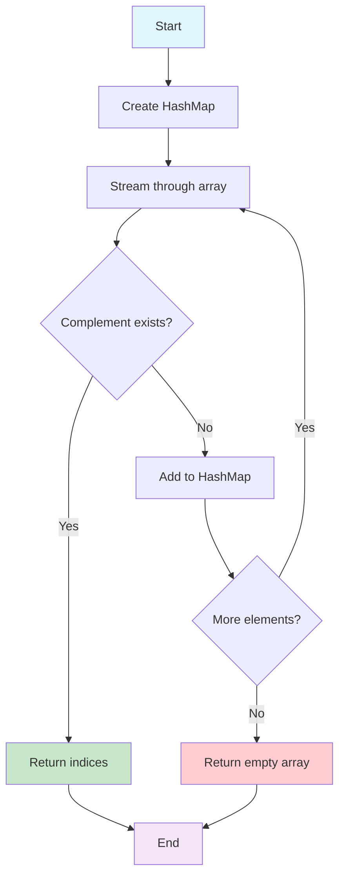

### 2. Best Time to Buy and Sell Stock

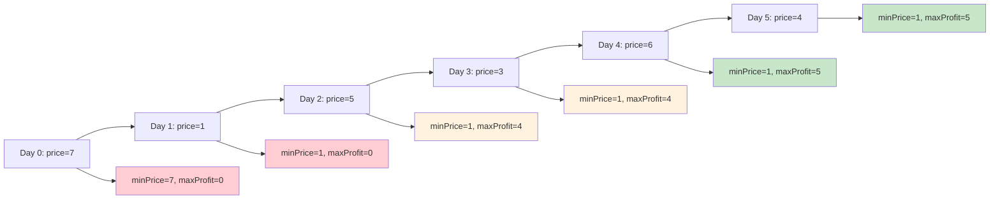

### 3. Contains Duplicate

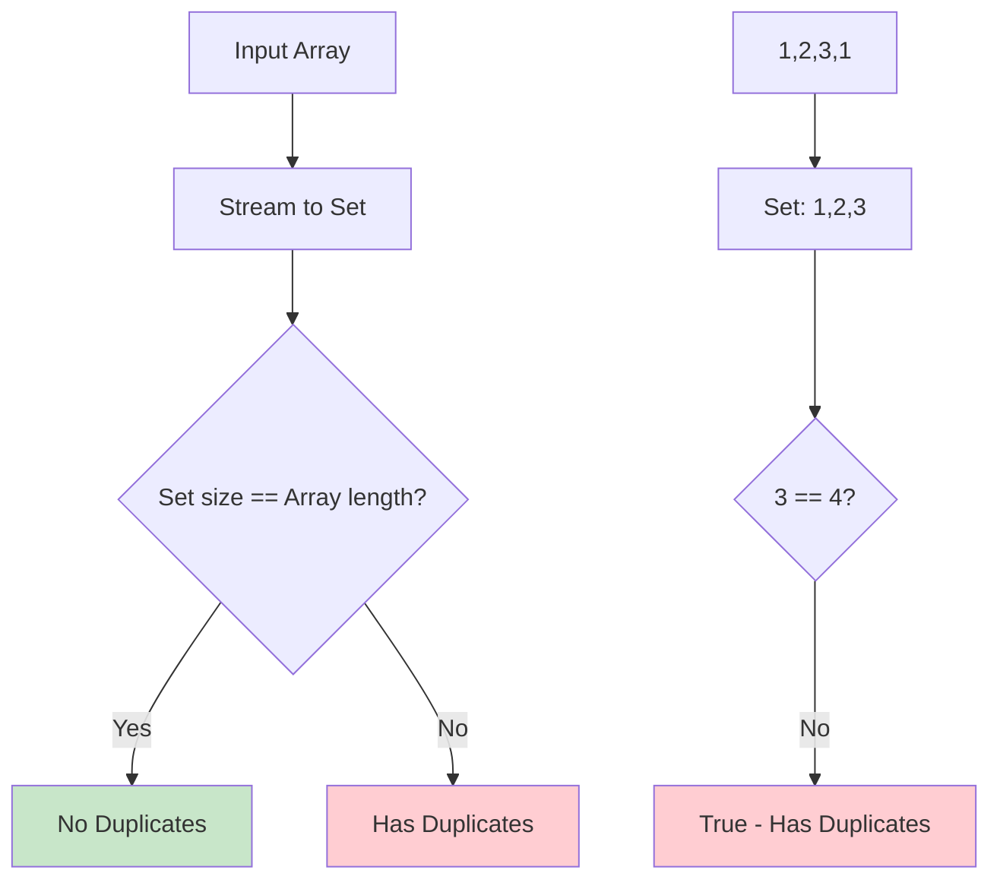

### 4. Product of Array Except Self

```mermaid
graph LR
    A[Input: 1,2,3,4] --> B[First Pass: Left Products]
    B --> C[1,1,2,6]
    C --> D[Second Pass: Right Products]
    D --> E[24,12,8,6]
    
    B1[result[0] = 1] --> B2[result[1] = 1*1 = 1]
    B2 --> B3[result[2] = 1*2 = 2]
    B3 --> B4[result[3] = 2*3 = 6]
    
    D1[rightProduct = 1] --> D2[result[3] = 6*1 = 6]
    D2 --> D3[result[2] = 2*4 = 8]
    D3 --> D4[result[1] = 1*12 = 12]
    D4 --> D5[result[0] = 1*24 = 24]
    
    style A fill:#e1f5fe
    style E fill:#c8e6c9
```

### 5. Maximum Subarray (Kadane's Algorithm)

```mermaid
graph TD
    A[Start with first element] --> B[For each element]
    B --> C{maxEndingHere = max(num, maxEndingHere + num)}
    C --> D{maxSoFar = max(maxSoFar, maxEndingHere)}
    D --> E{More elements?}
    E -->|Yes| B
    E -->|No| F[Return maxSoFar]
    
    G[Example: -2,1,-3,4,-1,2,1,-5,4]
    G --> H[Step 1: maxEndingHere=-2, maxSoFar=-2]
    H --> I[Step 2: maxEndingHere=1, maxSoFar=1]
    I --> J[Step 3: maxEndingHere=-2, maxSoFar=1]
    J --> K[Step 4: maxEndingHere=4, maxSoFar=4]
    K --> L[Step 5: maxEndingHere=3, maxSoFar=4]
    L --> M[Step 6: maxEndingHere=5, maxSoFar=5]
    M --> N[Step 7: maxEndingHere=6, maxSoFar=6]
    N --> O[Step 8: maxEndingHere=1, maxSoFar=6]
    O --> P[Step 9: maxEndingHere=5, maxSoFar=6]
    
    style F fill:#c8e6c9
    style P fill:#c8e6c9
```

## 🔤 String Problems Diagrams

### 1. Valid Anagram

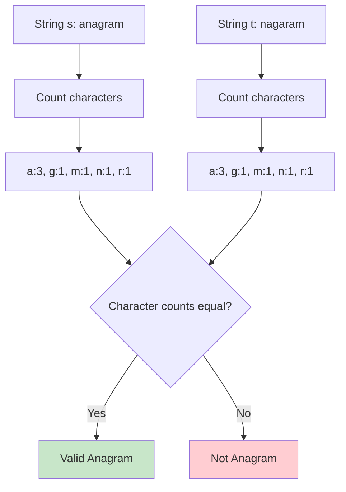

### 2. Valid Parentheses

```mermaid
graph TD
    A[Input: ()[]{}] --> B[Process each character]
    B --> C{Opening bracket?}
    C -->|Yes| D[Push to stack]
    C -->|No| E{Closing bracket?}
    E -->|Yes| F{Stack empty?}
    F -->|Yes| G[Invalid]
    F -->|No| H{Matches top?}
    H -->|Yes| I[Pop from stack]
    H -->|No| G
    E -->|No| B
    D --> B
    I --> B
    
    J[Stack: ] --> K[Stack: (]
    K --> L[Stack: ]
    L --> M[Stack: []]
    M --> N[Stack: ]
    N --> O[Stack: {}]
    O --> P[Stack: ]
    
    style G fill:#ffcdd2
    style P fill:#c8e6c9
```

### 3. Longest Substring Without Repeating Characters

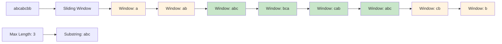

### 4. Longest Palindromic Substring

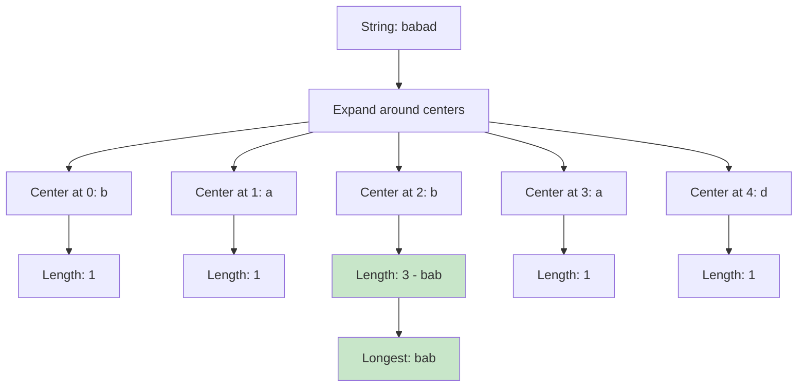

## 🌳 Tree Problems Diagrams

### 1. Maximum Depth of Binary Tree

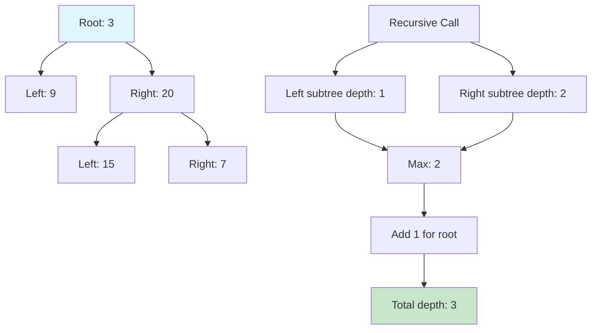

### 2. Same Tree

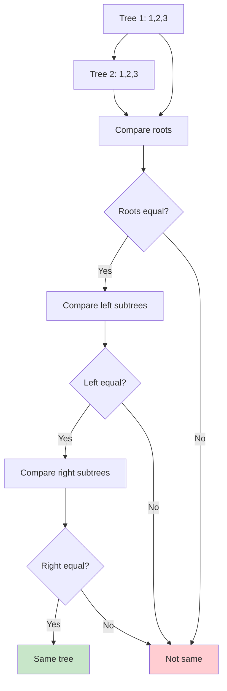

## 🎯 Dynamic Programming Diagrams

### 1. Climbing Stairs

```mermaid
graph TD
    A[n=5] --> B[Base cases: n=1, n=2]
    B --> C[For i=3 to n]
    C --> D[ways[i] = ways[i-1] + ways[i-2]
    D --> E[Return ways[n]]
    
    F[Step by step:]
    F --> G[ways[1] = 1]
    G --> H[ways[2] = 2]
    H --> I[ways[3] = 3]
    I --> J[ways[4] = 5]
    J --> K[ways[5] = 8]
    
    style E fill:#c8e6c9
    style K fill:#c8e6c9
```

### 2. House Robber

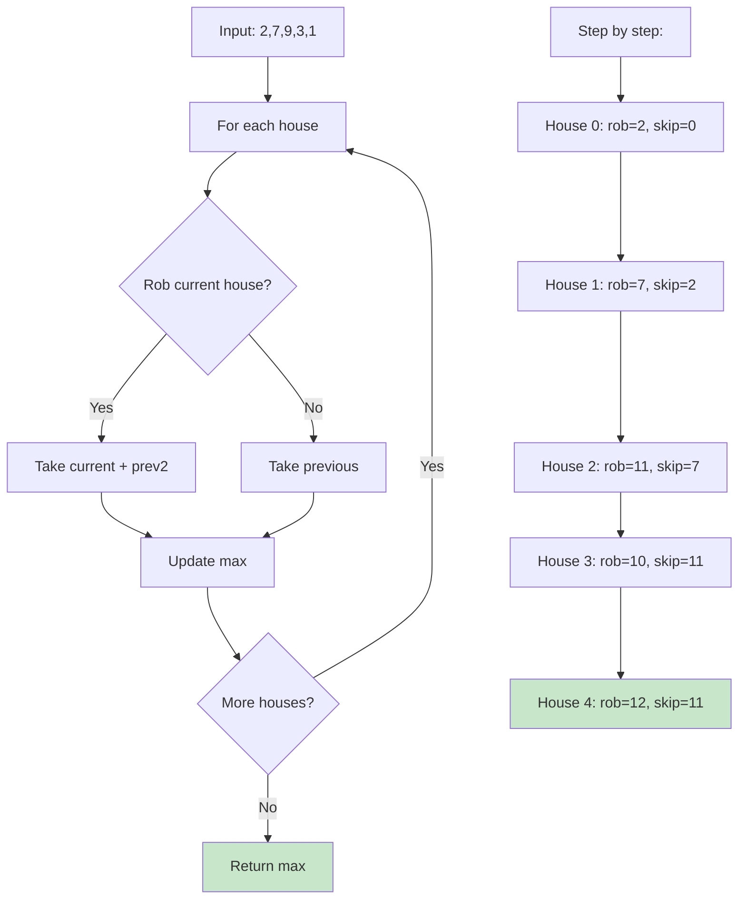

## 🔄 Stream Processing Pipeline

### General Stream Pattern

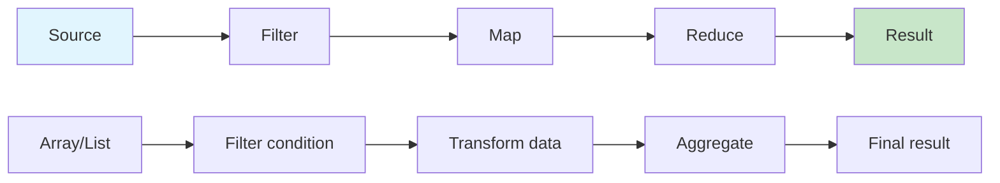

### Two Sum Stream Pipeline

```mermaid
graph TD
    A[IntStream.range] --> B[.boxed()]
    B --> C[.flatMap()]
    C --> D[.filter()]
    D --> E[.findFirst()]
    E --> F[.orElse()]
    
    A1[0,1,2,3] --> B1[0,1,2,3]
    B1 --> C1[All pairs]
    C1 --> D1[Sum equals target]
    D1 --> E1[First match]
    E1 --> F1[Indices or empty]
    
    style A fill:#e1f5fe
    style F fill:#c8e6c9
```

## 🎨 Complexity Analysis Charts

### Time Complexity Comparison

```mermaid
graph TD
    A[O(1)] --> A1[Constant]
    B[O(log n)] --> B1[Logarithmic]
    C[O(n)] --> C1[Linear]
    D[O(n log n)] --> D1[Linearithmic]
    E[O(n²)] --> E1[Quadratic]
    F[O(2ⁿ)] --> F1[Exponential]
    
    A1 --> A2[Best]
    B1 --> B2[Good]
    C1 --> C2[Acceptable]
    D1 --> D3[Moderate]
    E1 --> D4[Poor]
    F1 --> D5[Avoid]
    
    style A2 fill:#c8e6c9
    style B2 fill:#c8e6c9
    style C2 fill:#fff3e0
    style D3 fill:#fff3e0
    style D4 fill:#ffcdd2
    style D5 fill:#ffcdd2
```

### Space Complexity Comparison

```mermaid
graph TD
    A[O(1)] --> A1[Constant Space]
    B[O(log n)] --> B1[Logarithmic Space]
    C[O(n)] --> C1[Linear Space]
    D[O(n²)] --> D1[Quadratic Space]
    
    A1 --> A2[Optimal]
    B1 --> B2[Good]
    C1 --> C2[Acceptable]
    D1 --> D2[Poor]
    
    style A2 fill:#c8e6c9
    style B2 fill:#c8e6c9
    style C2 fill:#fff3e0
    style D2 fill:#ffcdd2
```

## 🚀 Performance Optimization Patterns

### Stream Optimization

```mermaid
graph TD
    A[Large Dataset] --> B{Parallel Processing?}
    B -->|Yes| C[parallelStream()]
    B -->|No| D[stream()]
    C --> E[Fork-Join Pool]
    D --> F[Single Thread]
    E --> G[Combined Results]
    F --> G
    G --> H[Optimized Output]
    
    style C fill:#c8e6c9
    style E fill:#c8e6c9
    style H fill:#c8e6c9
```

### Memory Optimization

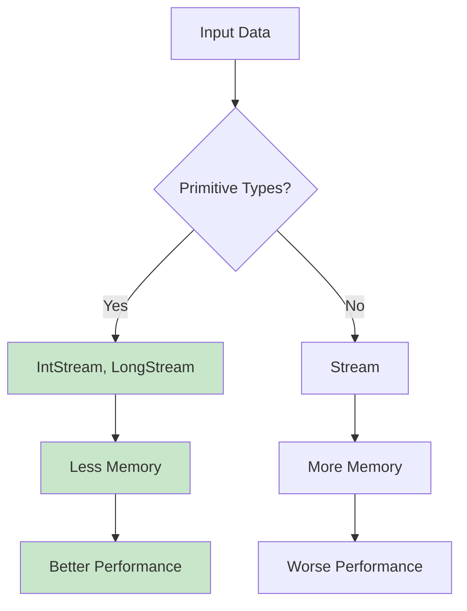

## 📚 Learning Path Visualization

### Problem Difficulty Progression

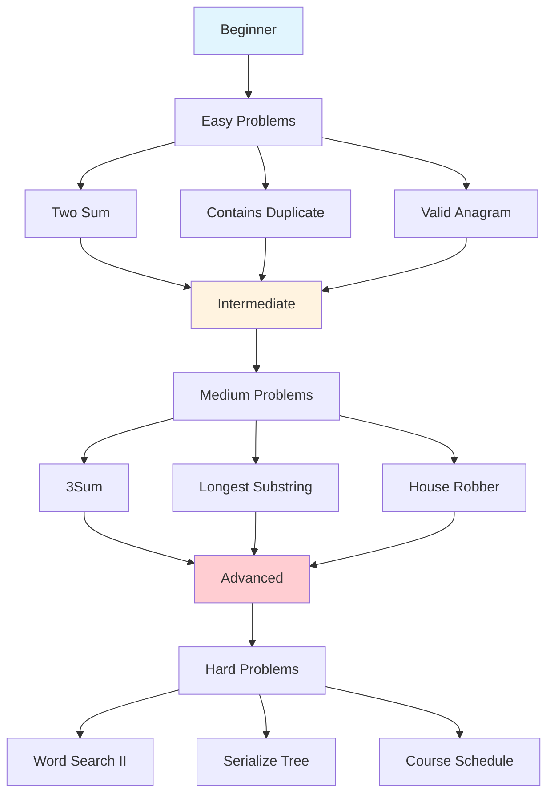

### Functional Programming Concepts

```mermaid
graph TD
    A[Stream API] --> B[Lambda Expressions]
    A --> C[Method References]
    A --> D[Optional]
    A --> E[Collectors]
    
    B --> F[Predicate]
    B --> G[Function]
    B --> H[Consumer]
    B --> I[Supplier]
    
    C --> J[Static Methods]
    C --> K[Instance Methods]
    C --> L[Constructor References]
    
    D --> M[Null Safety]
    D --> N[Chain Operations]
    
    E --> O[toList()]
    E --> P[groupingBy()]
    E --> Q[partitioningBy()]
    
    style A fill:#e1f5fe
    style F fill:#c8e6c9
    style G fill:#c8e6c9
    style H fill:#c8e6c9
    style I fill:#c8e6c9
```

## 🎯 Conclusion

These diagrams provide visual representations of the algorithms and data structures used in the LeetCode Blind 75 problems. They help in understanding:

1. **Algorithm Flow**: Step-by-step execution of solutions
2. **Data Structures**: How data is organized and processed
3. **Complexity Analysis**: Time and space requirements
4. **Optimization Patterns**: Best practices for performance
5. **Learning Path**: Progressive difficulty and concept building

Use these diagrams as a reference while studying the solutions to gain a deeper understanding of the underlying concepts and patterns.

---

**Happy Learning! 🎉**

*Visual learning makes complex algorithms easier to understand and remember.*
