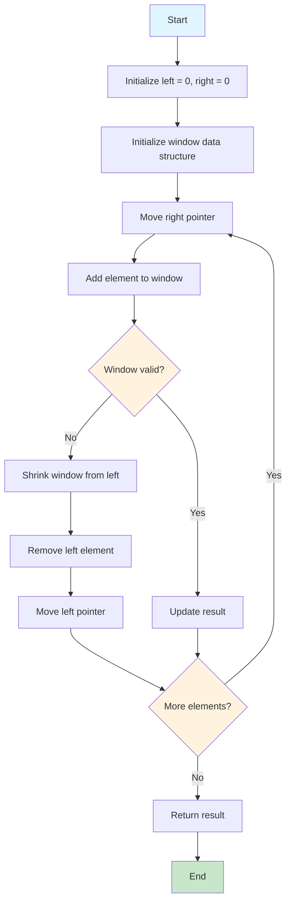

# Animated Sliding Window Flowchart

## Interactive Mermaid Diagram

Copy this code into [Mermaid Live Editor](https://mermaid.live/) or any Mermaid-compatible platform:



## Step-by-Step Animation for "abcabcbb"

### Step 1: Initial State
```
String: "abcabcbb"
        ↑
        left=0, right=0
Window: {a}
MaxLength: 1
```

### Step 2: Expand Right
```
String: "abcabcbb"
        ↑↑
        left=0, right=1
Window: {a, b}
MaxLength: 2
```

### Step 3: Expand Right
```
String: "abcabcbb"
        ↑ ↑
        left=0, right=2
Window: {a, b, c}
MaxLength: 3
```

### Step 4: Duplicate Found - Shrink Left
```
String: "abcabcbb"
         ↑ ↑
         left=1, right=3
Window: {b, c} (removed 'a')
MaxLength: 3
```

### Step 5: Expand Right
```
String: "abcabcbb"
         ↑  ↑
         left=1, right=4
Window: {b, c, a}
MaxLength: 3
```

### Step 6: Duplicate Found - Shrink Left
```
String: "abcabcbb"
          ↑  ↑
          left=2, right=4
Window: {c, a} (removed 'b')
MaxLength: 3
```

## Interactive HTML Animation

Here's a complete HTML file with JavaScript animation:

```html
<!DOCTYPE html>
<html>
<head>
    <title>Sliding Window Animation</title>
    <style>
        .container {
            font-family: 'Courier New', monospace;
            margin: 20px;
        }
        .string {
            font-size: 24px;
            letter-spacing: 2px;
            margin: 20px 0;
        }
        .pointer {
            color: red;
            font-weight: bold;
        }
        .window {
            background-color: #e3f2fd;
            padding: 2px 4px;
            border-radius: 3px;
        }
        .controls {
            margin: 20px 0;
        }
        button {
            padding: 10px 20px;
            margin: 5px;
            font-size: 16px;
            cursor: pointer;
        }
        .info {
            background-color: #f5f5f5;
            padding: 10px;
            border-radius: 5px;
            margin: 10px 0;
        }
    </style>
</head>
<body>
    <div class="container">
        <h1>Sliding Window Animation: "abcabcbb"</h1>
        
        <div class="string" id="stringDisplay"></div>
        
        <div class="info">
            <div>Left Pointer: <span id="leftPos">0</span></div>
            <div>Right Pointer: <span id="rightPos">0</span></div>
            <div>Window: <span id="window">[]</span></div>
            <div>Max Length: <span id="maxLength">0</span></div>
        </div>
        
        <div class="controls">
            <button onclick="startAnimation()">Start Animation</button>
            <button onclick="nextStep()">Next Step</button>
            <button onclick="reset()">Reset</button>
        </div>
        
        <div id="explanation"></div>
    </div>

    <script>
        const s = "abcabcbb";
        let left = 0;
        let right = 0;
        let maxLength = 0;
        let window = new Set();
        let step = 0;
        let isAnimating = false;

        function updateDisplay() {
            let display = "";
            for (let i = 0; i < s.length; i++) {
                if (i >= left && i <= right) {
                    display += `<span class="window">${s[i]}</span>`;
                } else {
                    display += s[i];
                }
            }
            
            document.getElementById("stringDisplay").innerHTML = display;
            document.getElementById("leftPos").textContent = left;
            document.getElementById("rightPos").textContent = right;
            document.getElementById("window").textContent = Array.from(window).join(", ");
            document.getElementById("maxLength").textContent = maxLength;
        }

        function nextStep() {
            if (right >= s.length) return;
            
            const currentChar = s[right];
            const explanation = document.getElementById("explanation");
            
            if (window.has(currentChar)) {
                explanation.innerHTML = `<p><strong>Step ${step + 1}:</strong> Duplicate '${currentChar}' found! Shrinking window from left...</p>`;
                window.delete(s[left]);
                left++;
            } else {
                explanation.innerHTML = `<p><strong>Step ${step + 1}:</strong> Adding '${currentChar}' to window...</p>`;
                window.add(currentChar);
                right++;
            }
            
            maxLength = Math.max(maxLength, right - left);
            step++;
            updateDisplay();
        }

        function startAnimation() {
            if (isAnimating) return;
            isAnimating = true;
            
            const interval = setInterval(() => {
                if (right >= s.length) {
                    clearInterval(interval);
                    isAnimating = false;
                    document.getElementById("explanation").innerHTML += "<p><strong>Animation Complete!</strong> Final result: " + maxLength + "</p>";
                    return;
                }
                nextStep();
            }, 1500);
        }

        function reset() {
            left = 0;
            right = 0;
            maxLength = 0;
            window.clear();
            step = 0;
            isAnimating = false;
            updateDisplay();
            document.getElementById("explanation").innerHTML = "";
        }

        // Initialize
        updateDisplay();
    </script>
</body>
</html>
```

## Usage Instructions

1. **For Mermaid diagrams**: Copy the Mermaid code into [Mermaid Live Editor](https://mermaid.live/)
2. **For HTML animation**: Save the HTML code as a `.html` file and open it in your browser
3. **For documentation**: Include the Mermaid code in your Markdown files (GitHub supports Mermaid)

## Additional Animated Examples

Would you like me to create animated diagrams for:
- Longest Substring with K Distinct Characters
- Minimum Window Substring
- Fixed Size Window problems
- Two Pointers technique

Let me know which specific sliding window problems you'd like to see animated!
