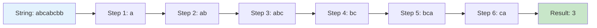

# 🎯 Sliding Window Algorithm - Interactive Diagrams

## Algorithm Flowchart

```mermaid
flowchart TD
    A[Start] --> B[Initialize left = 0, right = 0]
    B --> C[Initialize window = Set()]
    C --> D[Move right pointer]
    D --> E[Add element to window]
    E --> F{Character already in window?}
    F -->|No| G[Update maxLength]
    F -->|Yes| H[Shrink window from left]
    H --> I[Remove left character]
    I --> J[Move left pointer]
    J --> K{More characters?}
    G --> K
    K -->|Yes| D
    K -->|No| L[Return maxLength]
    L --> M[End]
    
    style A fill:#e1f5fe
    style M fill:#c8e6c9
    style F fill:#fff3e0
    style K fill:#fff3e0
```

## Step-by-Step Animation for "abcabcbb"

### Step 1: Initialize
```
String: "abcabcbb"
        ↑
        left=0, right=0
Window: {a}
MaxLength: 1
```

### Step 2: Expand Right
```
String: "abcabcbb"
        ↑↑
        left=0, right=1
Window: {a, b}
MaxLength: 2
```

### Step 3: Expand Right
```
String: "abcabcbb"
        ↑ ↑
        left=0, right=2
Window: {a, b, c}
MaxLength: 3
```

### Step 4: Duplicate Found - Shrink Left
```
String: "abcabcbb"
         ↑ ↑
         left=1, right=3
Window: {b, c} (removed 'a')
MaxLength: 3
```

### Step 5: Expand Right
```
String: "abcabcbb"
         ↑  ↑
         left=1, right=4
Window: {b, c, a}
MaxLength: 3
```

### Step 6: Duplicate Found - Shrink Left
```
String: "abcabcbb"
          ↑  ↑
          left=2, right=4
Window: {c, a} (removed 'b')
MaxLength: 3
```

## Interactive HTML Animation

For a fully interactive experience, you can:

1. **View the HTML file directly** by clicking on it in GitHub
2. **Use GitHub Pages** to host the animation
3. **Embed in documentation** using GitHub's file viewer

### Quick Setup for GitHub Pages:

1. Go to your repository settings
2. Scroll to "Pages" section
3. Select "Deploy from a branch"
4. Choose "main" branch and "/ (root)" folder
5. Your HTML files will be available at: `https://yourusername.github.io/repository-name/filename.html`

## Algorithm Implementation

```java
public static int longestSubstringWithoutRepeating(String s) {
    Set<Character> window = new HashSet<>();
    int left = 0;
    int maxLength = 0;
    
    for (int right = 0; right < s.length(); right++) {
        char currentChar = s.charAt(right);
        
        // Shrink window from left until no duplicates
        while (window.contains(currentChar)) {
            window.remove(s.charAt(left));
            left++;
        }
        
        window.add(currentChar);
        maxLength = Math.max(maxLength, right - left + 1);
    }
    
    return maxLength;
}
```

## Complexity Analysis

| Aspect | Complexity | Explanation |
|--------|------------|-------------|
| Time | O(n) | Each character visited at most twice |
| Space | O(min(m,n)) | m = charset size, n = string length |

## Visual Representation



## Usage in GitHub

1. **Copy this markdown** into your repository
2. **The Mermaid diagrams will render automatically** in GitHub
3. **Add the HTML files** for interactive animations
4. **Link to GitHub Pages** for full functionality

## Next Steps

- [ ] Add more sliding window problems
- [ ] Create interactive examples
- [ ] Add complexity analysis diagrams
- [ ] Include test cases and edge cases
